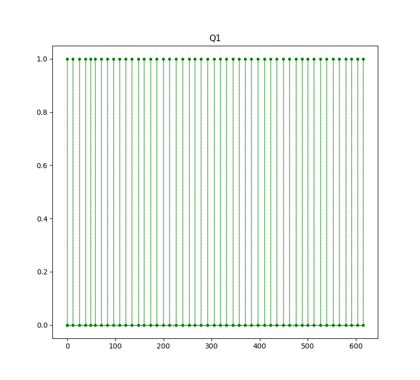
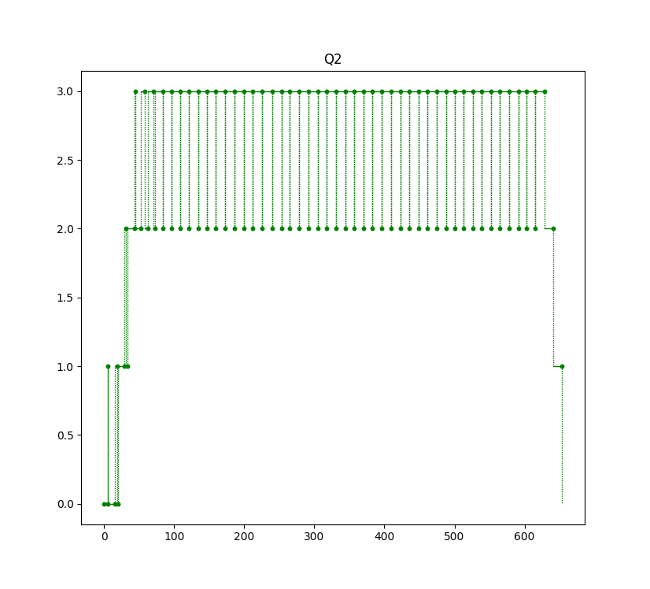
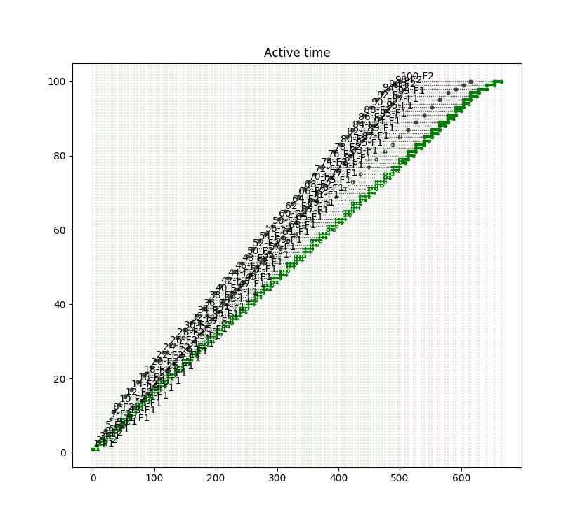
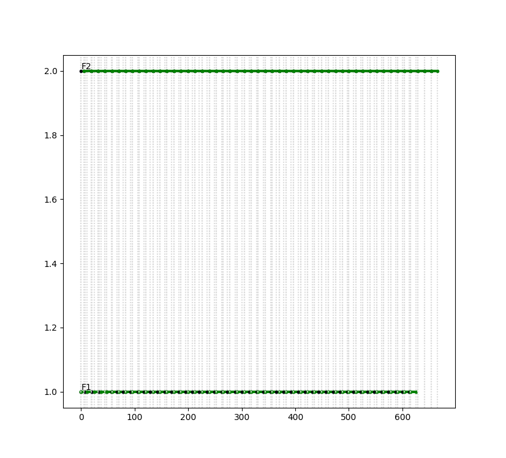
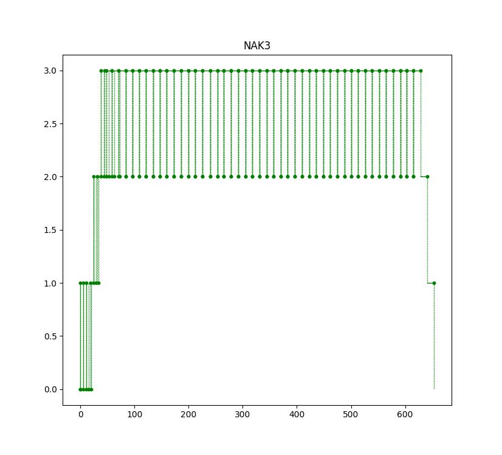

# Пример 3.13

Б.Я.Советов, Моделирование систем. Практикум: Учеб пособие для вузов/Б.Я. Советов, С.А. Яковлев.- 2-е изд., перераб. и доп.-М.:Высш. шк., 2003.-295 с.: ил.

Поток заявок поступает в накопитель с допустимой ёмкостью, равной 3 единицам, равномерно каждые 5+/-1 мин. Если заявки после накопителя застают 1-й обслуживающий канал (устройсто) занятым, то они поступают на обработку во второй канал. Время обработки 1-го канала равно 9+/-1 мин, 2-го 13+/-1 мин. 

Смоделировать обработку 100 заявок.

**ВНИМАНИЕ**
Программа на рис. 3.28 не соответствует примеру в книге.

 

Результат
=========

    === REPORT ===
    Start time      End time        Blocks       Facilities      Storages
           0.0    665.738961294            19                2             1
    === BLOCKS ===
    LABEL          BLOCK TYPE     ENTRY COUNT   CURRENT COUNT   RETRY
                      segment -----------------------------------
                     GENERATE          100            0            0
                        ENTER          100            0            0
                         GATE          100            0            0
                        QUEUE           49            0            0
                        SEIZE           49            0            0
                        LEAVE           49            0            0
                       DEPART           49            0            0
                       HANDLE           49            0            0
                      ADVANCE           49            0            0
                      RELEASE           49            0            0
                    TERMINATE           49           49            0
          QUE2          QUEUE           51            0            0
        FACIL2          SEIZE           51            0            0
                        LEAVE           51            0            0
                       DEPART           51            0            0
                       HANDLE           51            0            0
                      ADVANCE           51            0            0
                      RELEASE           51            0            0
                    TERMINATE           51           51            0
    
      FACILITY        ENTRIES        UTIL.    AVE. TIME       AVAIL.        OWNER         PEND        INTER        RETRY        DELAY
            F1             49        0.671   9.11395437217            0            0            0            0            0            0
            F2             51        0.992   12.9464883547            0            0            0            0            0            0
    
         QUEUE            MAX        ENTRY     ENTRY(0)     AVE.TIME        AVE.(-0)        RETRY
            Q1              1           49           49            0.0         None            0
            Q2              3           51            1     35.6686310446   36.3820036655            0
    
    
       STORAGE           CAP.         REM.         MIN.         MAX.      ENTRIES         AVL.       AVE.C.        UTIL.        RETRY        DELAY
          None             3            3            0            3          100         True   8.60126819846        2.867            0            0
    

    

