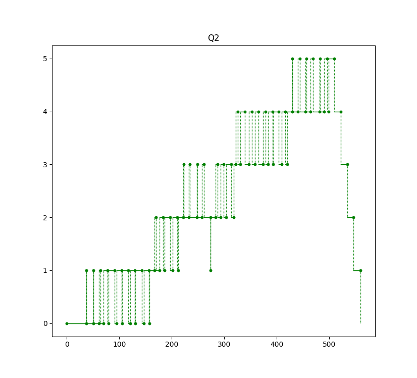
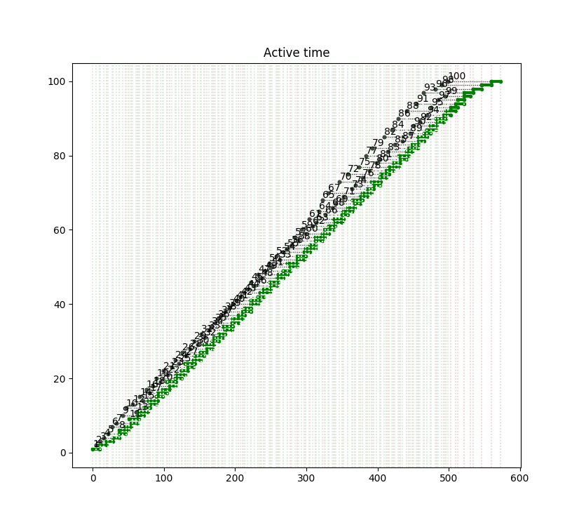
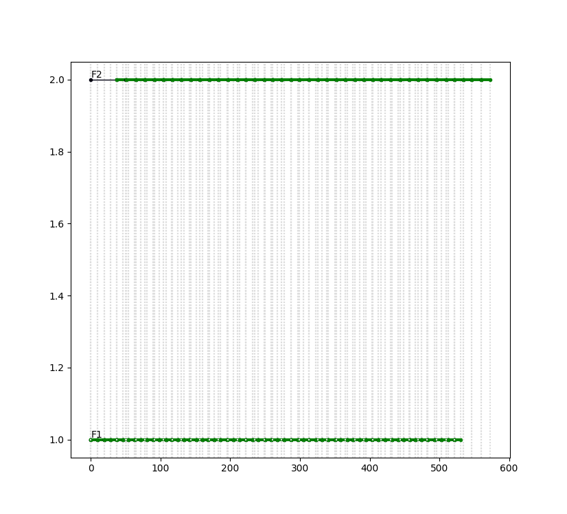
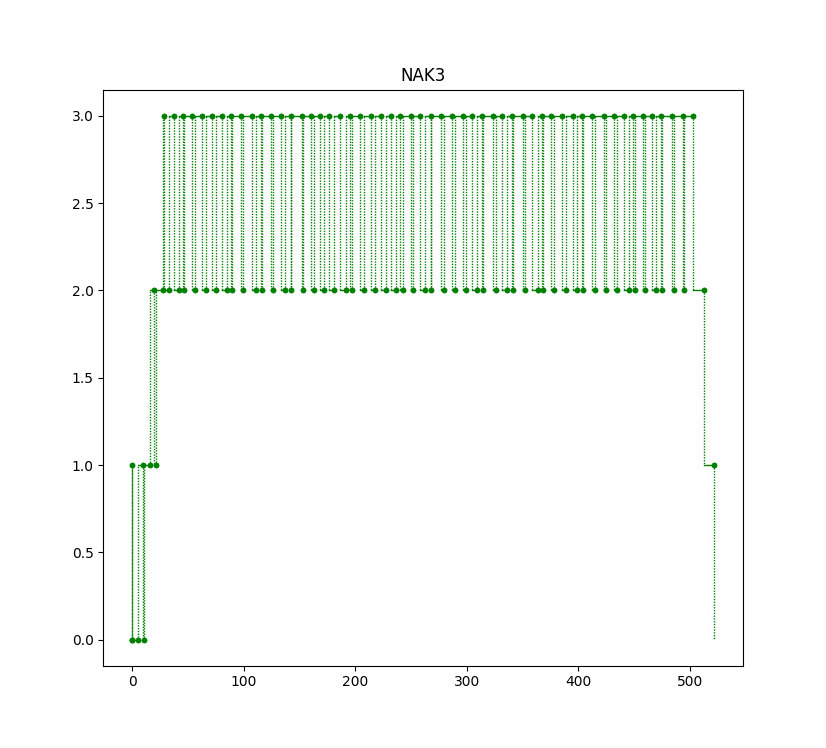

# Пример 3.13

Б.Я.Советов, Моделирование систем. Практикум: Учеб пособие для вузов/Б.Я. Советов, С.А. Яковлев.- 2-е изд., перераб. и доп.-М.:Высш. шк., 2003.-295 с.: ил.

Поток заявок поступает в накопитель с допустимой ёмкостью, равной 3 единицам, равномерно каждые 5+/-1 мин. Если заявки после накопителя застают 1-й обслуживающий канал (устройсто) занятым, то они поступают на обработку во второй канал. Время обработки 1-го канала равно 9+/-1 мин, 2-го 13+/-1 мин. 

Смоделировать обработку 100 заявок.

Результат
=========

    Start time      End time        Blocks       Facilities      Storages
           0.0    573.036576911            16                2             1
    === BLOCKS ===
    LABEL          BLOCK TYPE     ENTRY COUNT   CURRENT COUNT   RETRY
                      segment -----------------------------------
                     GENERATE          100            0            0
                         GATE          100            0            0
                        ENTER           59            0            0
                        QUEUE           59            0            0
                        SEIZE           59            0            0
                       DEPART           59            0            0
                        LEAVE           59            0            0
                      ADVANCE           59            0            0
                      RELEASE           59            0            0
                    TERMINATE           59           59            0
          QUE2          QUEUE           41            0            0
        FACIL2          SEIZE           41            0            0
                       DEPART           41            0            0
                      ADVANCE           41            0            0
                      RELEASE           41            0            0
                    TERMINATE           41           41            0
    
      FACILITY        ENTRIES        UTIL.    AVE. TIME       AVAIL.        OWNER         PEND        INTER        RETRY        DELAY
            F1             59        0.926   8.9979921347            0            0            0            0            0            0
            F2             41        0.933   13.0411347046            0            0            0            0            0            0
    
         QUEUE            MAX        ENTRY     ENTRY(0)     AVE.TIME        AVE.(-0)        RETRY
            Q1              3           59            1     22.7987315965   23.1918131757            0
            Q2              5           41            2     30.8643349196   32.4471213257            0
    
    
       STORAGE           CAP.         REM.         MIN.         MAX.      ENTRIES         AVL.       AVE.C.        UTIL.        RETRY        DELAY
          None             3            3            0            3           59         True   2.35570164436        0.785            0            0

    

