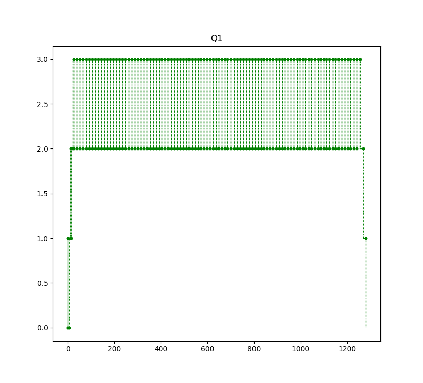
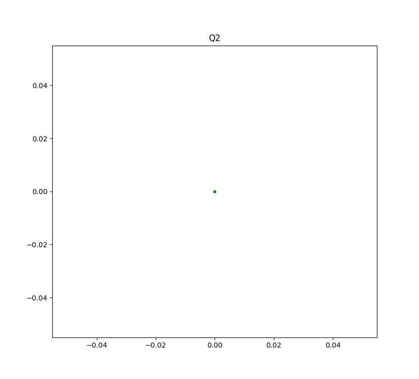
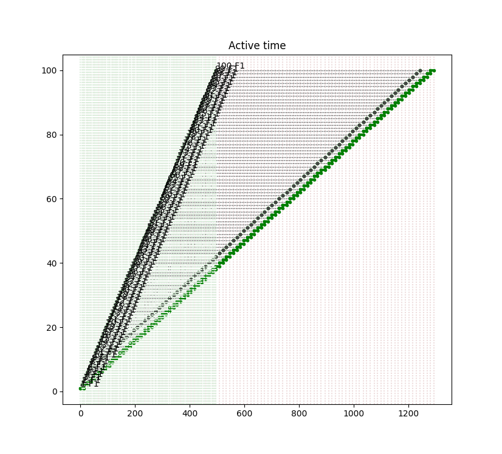
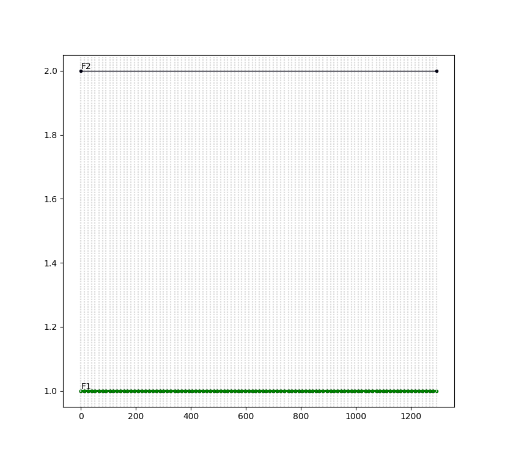

# Пример 3.14

Б.Я.Советов, Моделирование систем. Практикум: Учеб пособие для вузов/Б.Я. Советов, С.А. Яковлев.- 2-е изд., перераб. и доп.-М.:Высш. шк., 2003.-295 с.: ил.

Поток заявок поступает в накопитель с допустимой ёмкостью, равной 3 единицам, равномерно каждые 5+/-1 мин. Если заявки после накопителя застают 2-й канал (устройсто) занятым, то они поступают на обработку во второй канал. Время обработки 1-го канала равно 13+/-1 мин, 2-го 9+/-1 мин. 

Смоделировать обработку 100 заявок.

Результат
=========

    === REPORT ===
    Start time      End time        Blocks       Facilities      Storages
           0.0    1293.96818306            19                2             1
    === BLOCKS ===
    LABEL          BLOCK TYPE     ENTRY COUNT   CURRENT COUNT   RETRY
                      segment -----------------------------------
                     GENERATE          100            0            0
                        ENTER          100            0            0
                         GATE          100            0            0
                        QUEUE          100            0            0
                        SEIZE          100            0            0
                        LEAVE          100            0            0
                       DEPART          100            0            0
                       HANDLE          100            0            0
                      ADVANCE          100            0            0
                      RELEASE          100            0            0
                    TERMINATE          100          100            0
          QUE2          QUEUE            0            0            0
        FACIL2          SEIZE            0            0            0
                        LEAVE            0            0            0
                       DEPART            0            0            0
                       HANDLE            0            0            0
                      ADVANCE            0            0            0
                      RELEASE            0            0            0
                    TERMINATE            0            0            0
    
      FACILITY        ENTRIES        UTIL.    AVE. TIME       AVAIL.        OWNER         PEND        INTER        RETRY        DELAY
            F1            100        1.000   12.9396818306            0            0            0            0            0            0
            F2              0        0.000         None            0            0            0            0            0            0
    
         QUEUE            MAX        ENTRY     ENTRY(0)     AVE.TIME        AVE.(-0)        RETRY
            Q1              3          100            1     37.6636865186   38.0441277965            0
            Q2              0            0            0           None         None            0
    
    
       STORAGE           CAP.         REM.         MIN.         MAX.      ENTRIES         AVL.       AVE.C.        UTIL.        RETRY        DELAY
          None             3            3            0            3          100         True   4.81296872161        1.604            0            0

  

