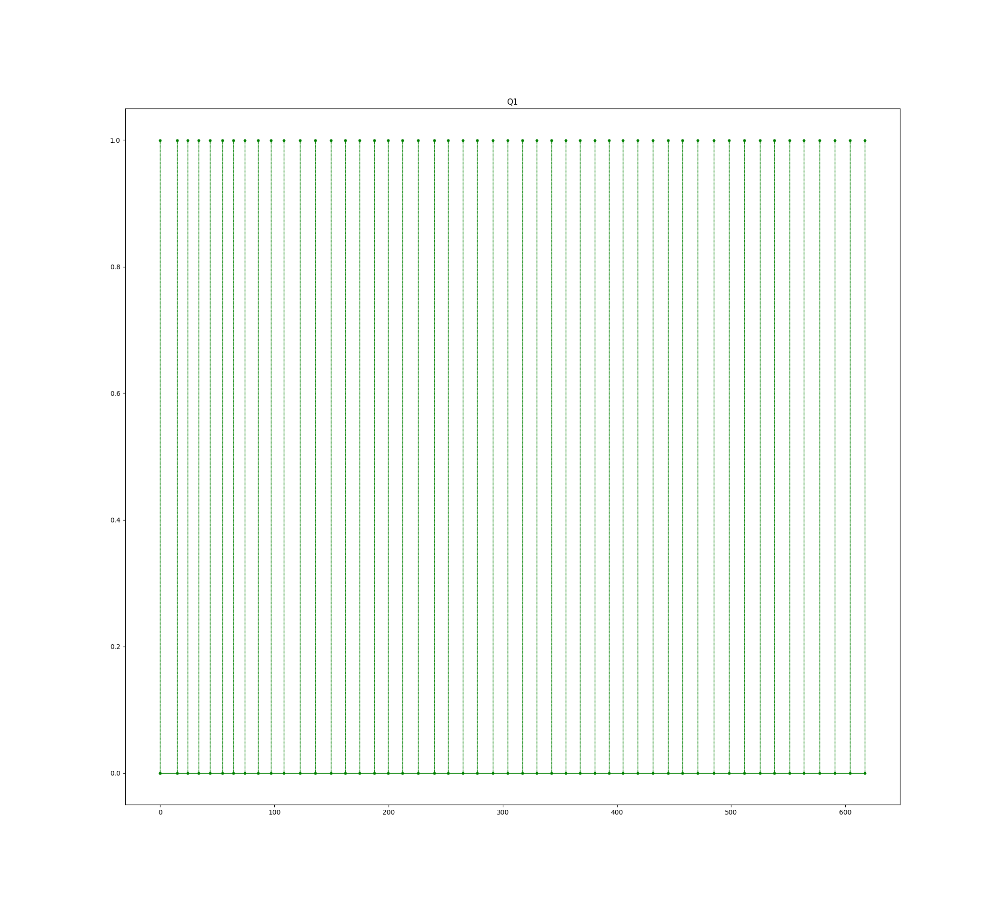
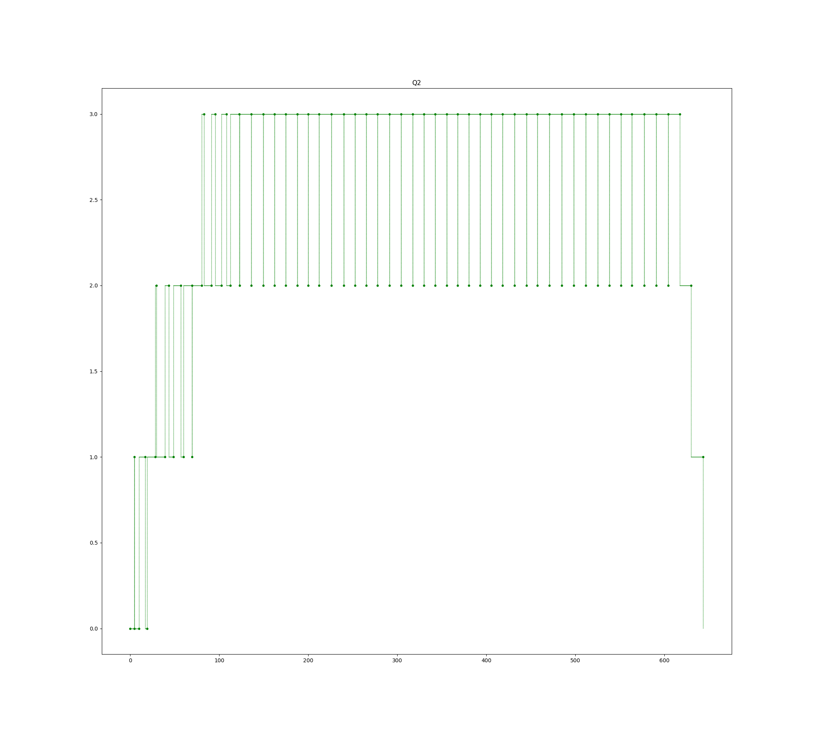
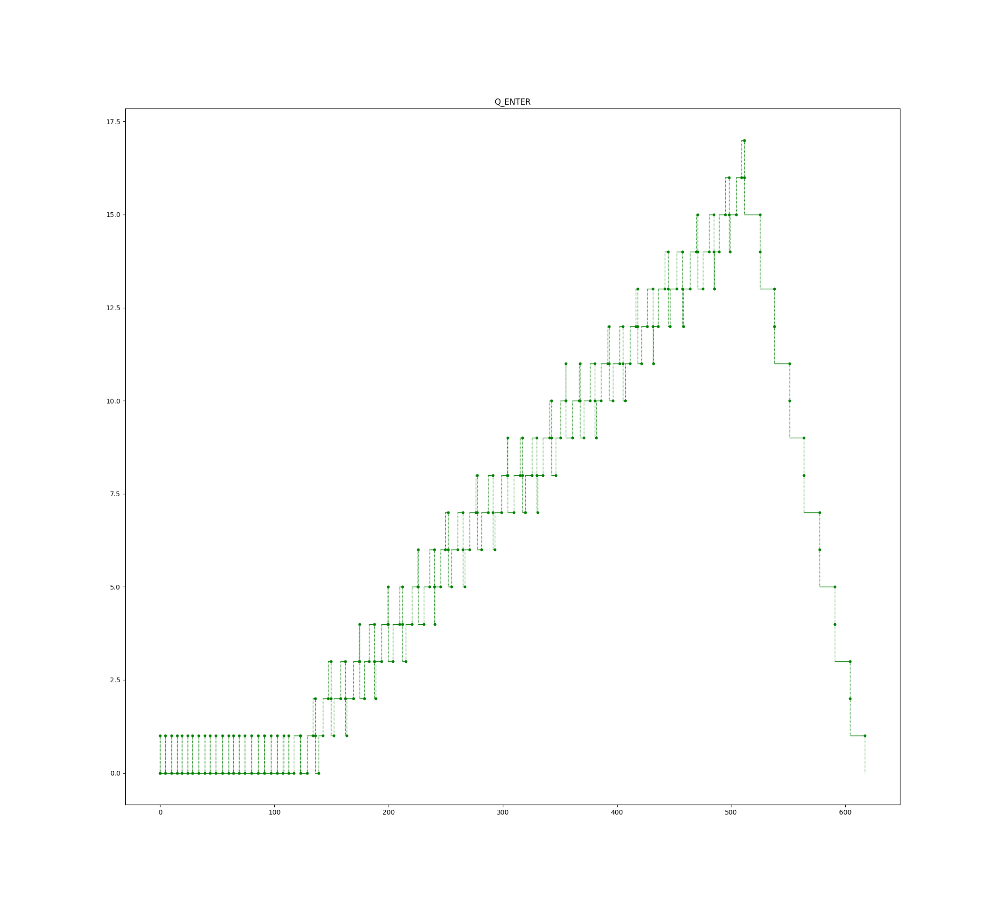
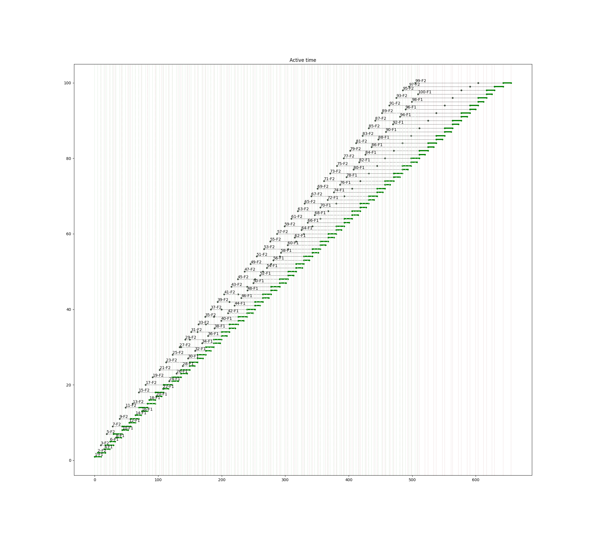
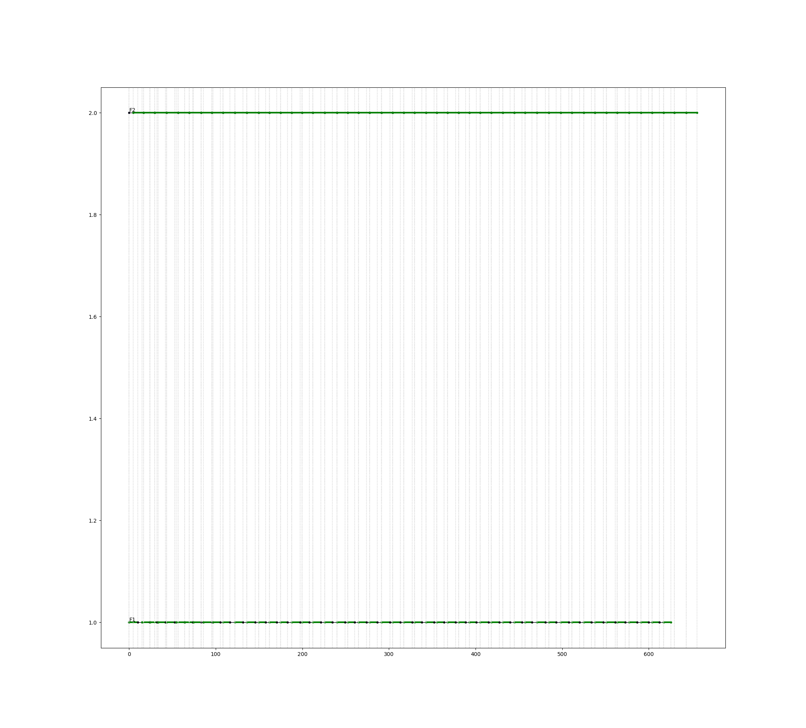
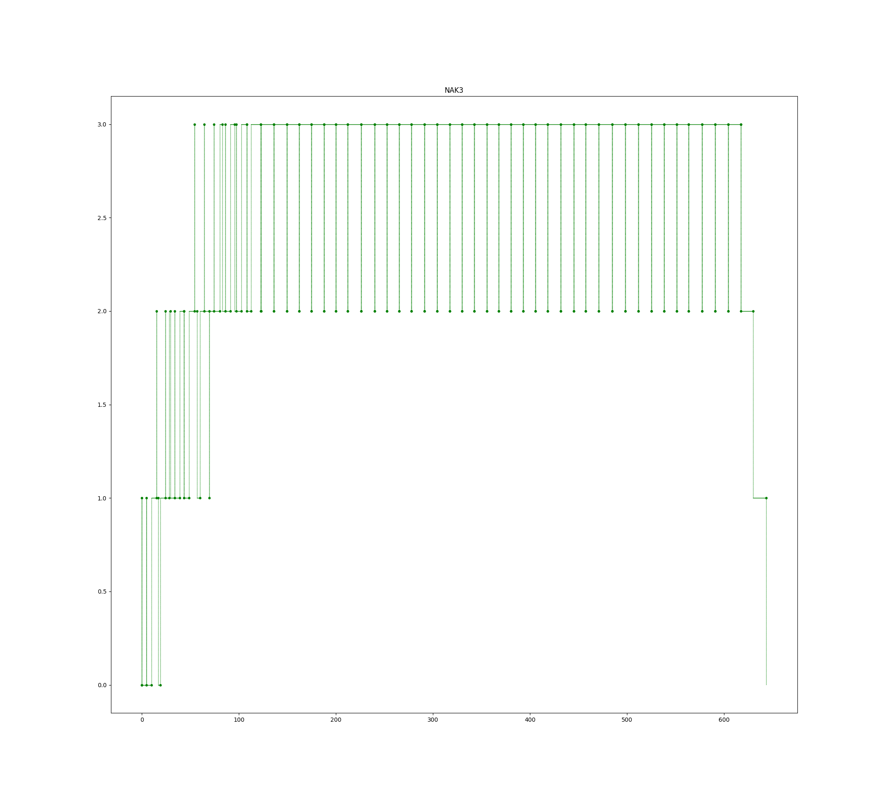

# Пример 3.15

Б.Я.Советов, Моделирование систем. Практикум: Учеб пособие для вузов/Б.Я. Советов, С.А. Яковлев.- 2-е изд., перераб. и доп.-М.:Высш. шк., 2003.-295 с.: ил.

Поток заявок поступает в накопитель с допустимой ёмкостью, равной 3 единицам, равномерно каждые 5+/-1 мин. Если 1-й канал (устройсто) занят, то они поступают на обработку во второй канал. Время обработки 1-го канала равно 9+/-1 мин, 2-го 13+/-1 мин. 

Смоделировать обработку 100 заявок.

Результат
=========

    === REPORT ===
    Start time      End time        Blocks       Facilities      Storages
           0.0    655.574440569            21                2             1
    === BLOCKS ===
    LABEL          BLOCK TYPE     ENTRY COUNT   CURRENT COUNT   RETRY
                      segment -----------------------------------
                     GENERATE          100            0            0
                        QUEUE          100            0            0
                        ENTER          100            0            0
                       DEPART          100            0            0
                         GATE          100            0            0
                        QUEUE           50            0            0
                        SEIZE           50            0            0
                        LEAVE           50            0            0
                       DEPART           50            0            0
                       HANDLE           50            0            0
                      ADVANCE           50            0            0
                      RELEASE           50            0            0
                    TERMINATE           50           50            0
          QUE2          QUEUE           50            0            0
        FACIL2          SEIZE           50            0            0
                        LEAVE           50            0            0
                       DEPART           50            0            0
                       HANDLE           50            0            0
                      ADVANCE           50            0            0
                      RELEASE           50            0            0
                    TERMINATE           50           50            0
    
      FACILITY        ENTRIES        UTIL.    AVE. TIME       AVAIL.        OWNER         PEND        INTER        RETRY        DELAY
            F1             50        0.683   8.95674967383            0            0            0            0            0            0
            F2             50        0.991   12.9919657986            0            0            0            0            0            0
    
         QUEUE            MAX        ENTRY     ENTRY(0)     AVE.TIME        AVE.(-0)        RETRY
            Q1              1           50           50            0.0         None            0
            Q2              3           50            1     34.1426589916   34.8394479506            0
       Q_ENTER             19          100           22     44.8647450473   57.5189039068            0
    
    
       STORAGE           CAP.         REM.         MIN.         MAX.      ENTRIES         AVL.       AVE.C.        UTIL.        RETRY        DELAY
          None             3            3            0            3          100         True   8.05911405289        2.686            0            0

  

