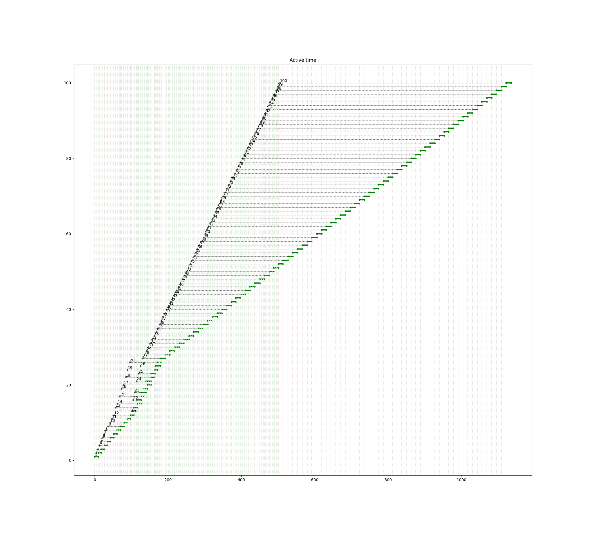
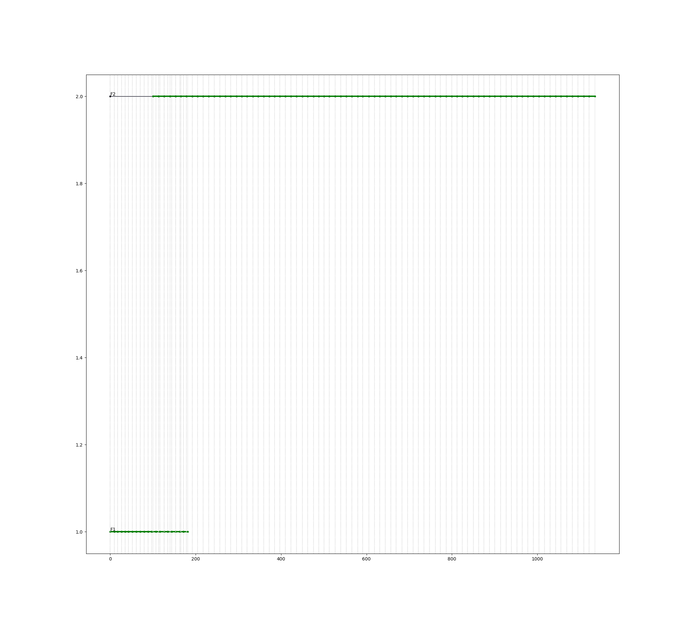

# Пример 3.16

Б.Я.Советов, Моделирование систем. Практикум: Учеб пособие для вузов/Б.Я. Советов, С.А. Яковлев.- 2-е изд., перераб. и доп.-М.:Высш. шк., 2003.-295 с.: ил.

Смоделировать процесс обслуживания потока заявок с интервалом 5+/-1 мин. дыумя каналами: обслуживание в 1-м канале длится 9+/-1 мин, 2-го 13+/-1 мин. Причём в течение первых 100 мин обслуживание производит 1-й канал, а по истечении 100 мин. - 2-й канал

Смоделировать обработку 100 заявок.

Результат
=========

	=== REPORT ===
	Start time      End time        Blocks       Facilities      Storages
		   0.0    1135.039026            10                2             0
	=== BLOCKS ===
	LABEL          BLOCK TYPE     ENTRY COUNT   CURRENT COUNT   RETRY
					  segment -----------------------------------
					 GENERATE          100            0            0
						 TEST          100            0            0
						SEIZE           20            0            0
					  ADVANCE           20            0            0
					  RELEASE           20            0            0
					 TRANSFER           20            0            0
		FACIL2          SEIZE           80            0            0
					  ADVANCE           80            0            0
					  RELEASE           80            0            0
		  EXIT      TERMINATE          100          100            0

	  FACILITY        ENTRIES        UTIL.    AVE. TIME       AVAIL.        OWNER         PEND        INTER        RETRY        DELAY
			F1             20        0.160   9.05738308759            0            0            0            0            0            0
			F2             80        0.912   12.9376410891            0            0            0            0            0            0

  

