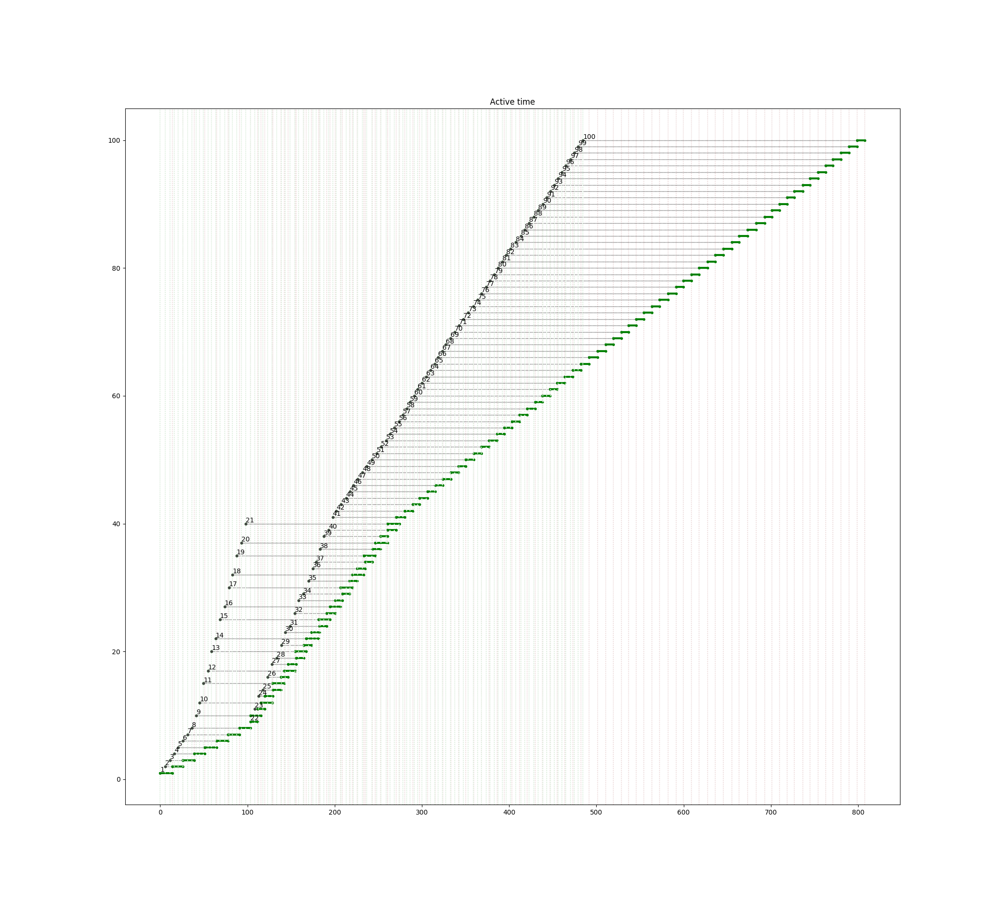
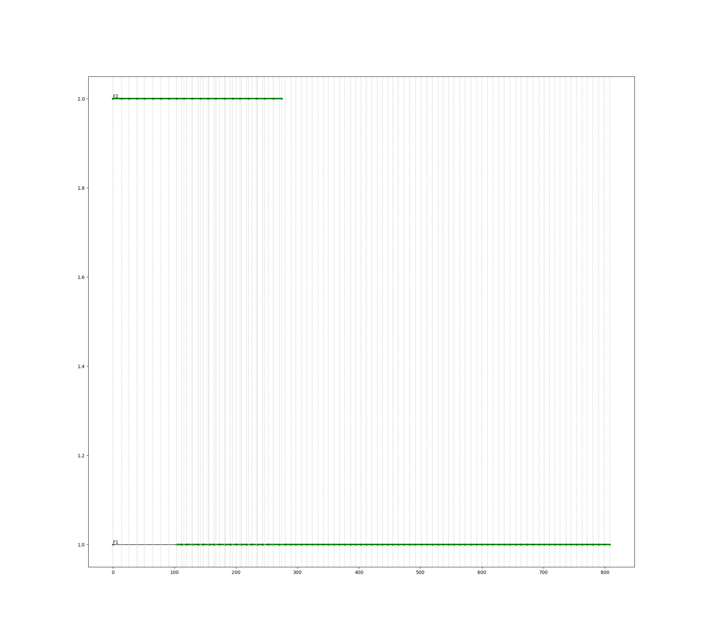

# Пример 3.17

Б.Я.Советов, Моделирование систем. Практикум: Учеб пособие для вузов/Б.Я. Советов, С.А. Яковлев.- 2-е изд., перераб. и доп.-М.:Высш. шк., 2003.-295 с.: ил.

Смоделировать процесс обслуживания потока заявок с интервалом 5+/-1 мин. дыумя каналами: обслуживание в 1-м канале длится 9+/-1 мин, 2-го 13+/-1 мин. Причём в течение первых 100 мин обслуживание производит 2-й канал, а по истечении 100 мин. - 1-й канал

Смоделировать обработку 100 заявок.

Результат
=========

    === REPORT ===
    Start time      End time        Blocks       Facilities      Storages
           0.0    807.634565285            10                2             0
    === BLOCKS ===
    LABEL          BLOCK TYPE     ENTRY COUNT   CURRENT COUNT   RETRY
                      segment -----------------------------------
                     GENERATE          100            0            0
                     TRANSFER          100            0            0
            F1          SEIZE           79            0            0
                      ADVANCE           79            0            0
                      RELEASE           79            0            0
                     TRANSFER           79            0            0
        FACIL2          SEIZE           21            0            0
                      ADVANCE           21            0            0
                      RELEASE           21            0            0
          EXIT      TERMINATE          100          100            0
    
      FACILITY        ENTRIES        UTIL.    AVE. TIME       AVAIL.        OWNER         PEND        INTER        RETRY        DELAY
            F1             79        0.872   8.91530131218            0            0            0            0            0            0
            F2             21        0.340   13.0586912229            0            0            0            0            0            0
    
    

