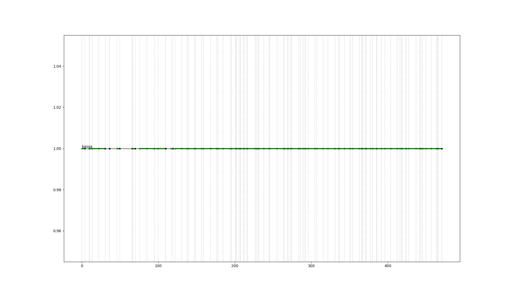
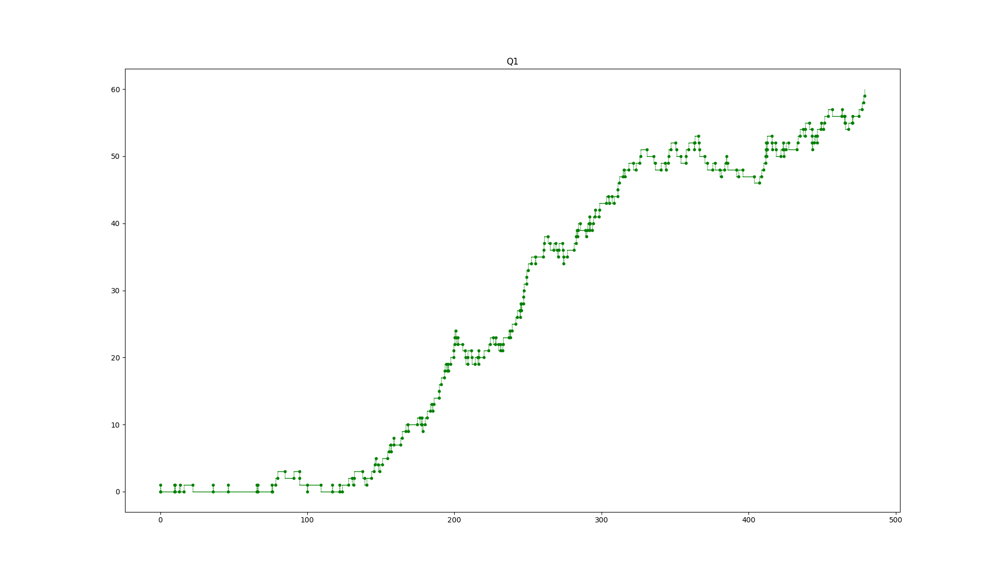

# carusel.py – Моделирование кассы в случае нестационарного потока покупателей

---

2017, Автор: Вялых Павел Викторович

---

**Постановка проблемы**

Время           Интенсивность,    Количество покупок    Относительная частота     Суммарная частота 
                чел/10 мин    
 9:00 - 11:00   2                (0-5]                   0.2                     0.2
 2*60 мин                        (5-20]                  0.3                     0.5    
                                 (20-50]                 0.2                     0.7
                                 (50-100]                0.2                     0.9
                                 (100..120]              0.1                     1.0

11:00 - 15:00   5                (0-5]                   0.2                     0.2
 4*60 мин                        (5-20]                  0.2                     0.4    
                                 (20-50]                 0.25                    0.65
                                 (50-100]                0.25                    0.9
                                 (100..120]              0.1                     1.0

15:00 - 17:00   3                (0-5]                   0.4                     0.4
 2*60 мин                        (5-20]                  0.3                     0.7    
                                 (20-50]                 0.18                    0.88
                                 (50-100]                0.1                     0.98
                                 (100..120]              0.02                    1.0

Каждая единица товара обрабатывается на кассе 5 сек.

Необходимо смоделировать систему инвентаризации в течение дня.

Построить гистограмму длины очереди.

## Результат

    === REPORT ===
    Start time      End time        Blocks       Facilities      Storages
             0    479.026836731             8                1             0
    === BLOCKS ===
    LABEL          BLOCK TYPE     ENTRY COUNT   CURRENT COUNT   RETRY
    SEGM_FACILITY        segment -----------------------------------
                     GENERATE          170            0            0
                       HANDLE          170            0            0
                        QUEUE          170           60            0
                        SEIZE          110            0            0
                       DEPART          110            0            0
                      ADVANCE          110            1            0
                      RELEASE          109            0            0
                    TERMINATE          109          109            0
    SEGM_MEASURE        segment -----------------------------------
    
      FACILITY        ENTRIES        UTIL.    AVE. TIME       AVAIL.        OWNER         PEND        INTER        RETRY        DELAY
         kassa            110        0.872   3.83180428135            0            0            0            0            0            0
    
         QUEUE            MAX        ENTRY     ENTRY(0)     AVE.TIME        AVE.(-0)        RETRY
            Q1             60          170           10     73.6944593877   81.0639053265            0
    
    
    

")

