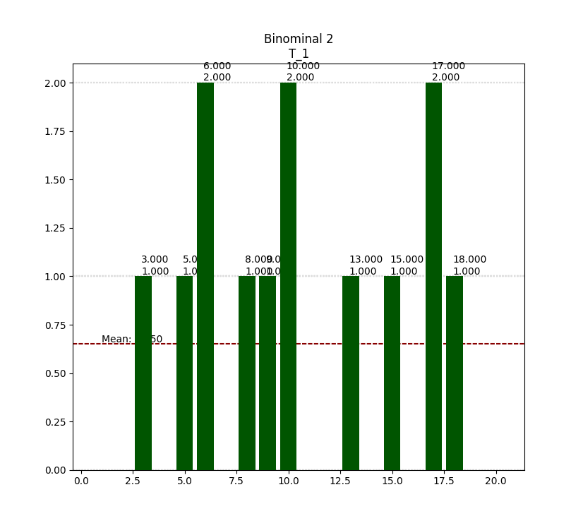
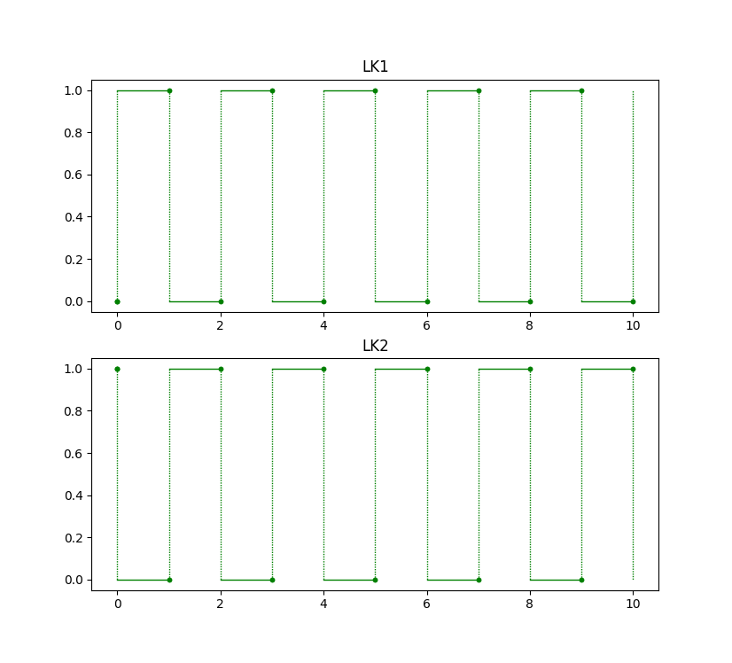
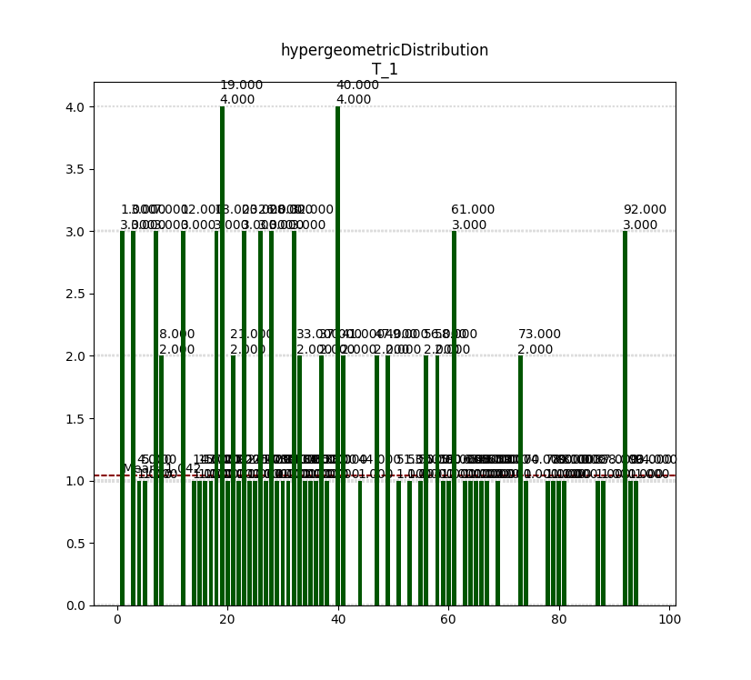

# Визуализация некоторых элементов

---

2017, Автор: Вялых Павел Викторович

---

## bernoulli

## Binominal 2\_001.png

## demo\_logic

Переключение локических ключей

## Discrete\_6\_001

## Гипергеометрические распределение

## Распределение Пуассона

